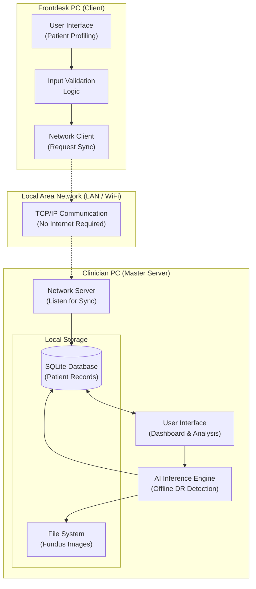

# EyeShield Thesis: Local Network Synchronization Architecture

This document summarizes the architectural decisions and technical implementation strategy for the **EyeShield** local network synchronization feature, as discussed for the thesis project.

## 1. Naming Convention
**Original Name:** Assessment  
**New Name:** Patient Profiling  
**Rationale:** The "Assessment" tab primarily functions as a data entry form for patient demographics and clinical history. "Patient Profiling" more accurately describes the content for both Frontdesk (data entry) and Clinicians (pre-analysis profiling) and aligns with the user's observation that the tab is "just a form."

---

## 2. Academic Defense (The Rationale)
When presenting to the thesis panel, use these three pillars to justify why the system remains **Offline/Local** instead of using the Cloud:

*   **Data Sovereignty & Privacy:** By keeping PHI (Patient Health Information) on a Local Area Network (Intranet), the system eliminates data breach risks associated with the public internet and complies with strict medical privacy standards (like HIPAA) at zero cost.
*   **Operational Resilience:** The system ensures 100% availability in rural or low-connectivity environments. Clinical workflows are never interrupted by internet outages.
*   **Infrastructure Efficiency:** The system leverages existing local hardware (office routers), removing the barrier of recurring cloud subscription fees for small clinics.

---

## 3. System Architecture Diagram
This diagram visualizes the interaction between the Frontdesk (Data Entry) and the Clinician (Analysis & AI).

---

## 4. Connection Methods (2 PC Setup)

### Method A: Infrastructure Mode (Recommended)
*   **Setup:** Both PCs connect to the same WiFi Router or Network Switch.
*   **Pros:** Highly scalable; looks professional (wireless); mimics a real-world clinic setup.
*   **Academic Term:** *Infrastructure-based Local Area Network.*

### Method B: Direct Mode (Fail-Safe)
*   **Setup:** A single Ethernet (LAN) cable connected directly between the two PCs.
*   **Pros:** 100% reliable; no interference; perfect for a "fail-safe" demo backup.
*   **Academic Term:** *Ad-Hoc Peer-to-Peer Connection.*

---

## 5. Detailed Step-by-Step Guide

Follow these steps to set up the connection for your thesis demonstration.

### Step-by-Step for the Master PC (Clinician/Server)
The Master PC acts as the central hub and hosts the primary database.

1.  **Network Setup:** 
    *   Connect to the Router (WiFi) or plug in the Ethernet cable.
    *   **Pro Tip:** Set a "Static IP" in Windows Network Settings so the IP address doesn't change during the demo.
2.  **Find your IP:**
    *   Open Command Prompt (`cmd`).
    *   Type `ipconfig` and look for `IPv4 Address` (e.g., `192.168.1.15`). **Write this down.**
3.  **Launch the System:**
    *   Open the EyeShield application.
    *   Run the `sync_server.py` script (this is the background bridge that listens for the Client).
4.  **Firewall Check:**
    *   Ensure Windows Firewall allows Python/EyeShield to communicate. (You may need to "Allow an app through Firewall").
5.  **Monitor:** Keep the `sync_server` terminal open. You will see text appear there when the Client connects.

---

### Step-by-Step for the Client PC (Frontdesk/Client)
The Client PC sends data to the Master PC over the network.

1.  **Network Setup:**
    *   Connect to the **exact same** WiFi or Router as the Master PC.
2.  **Connectivity Test:**
    *   Open `cmd` on the Client PC.
    *   Type `ping [MASTER_IP]` (e.g., `ping 192.168.1.15`).
    *   If you see "Reply from...", you are ready.
3.  **Configure EyeShield:**
    *   Open the EyeShield application on the Client PC.
    *   Go to **Settings > Network Configuration**.
    *   Enter the Master PC's IP Address and Save.
4.  **Execution:**
    *   Go to the **Patient Profiling** tab.
    *   Fill out the patient details.
    *   Click **"Save and Queue Patient"**.
5.  **Verification:**
    *   Check the Master PC’s **Dashboard**. The patient you just saved on the Client PC should appear there instantly.
